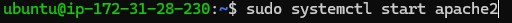
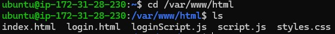
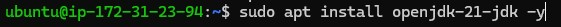
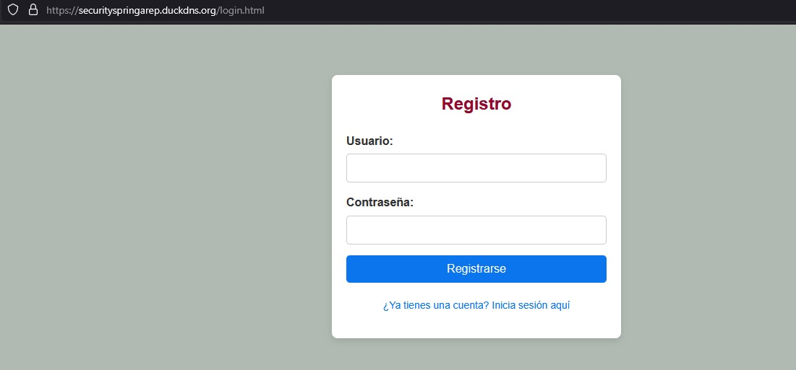
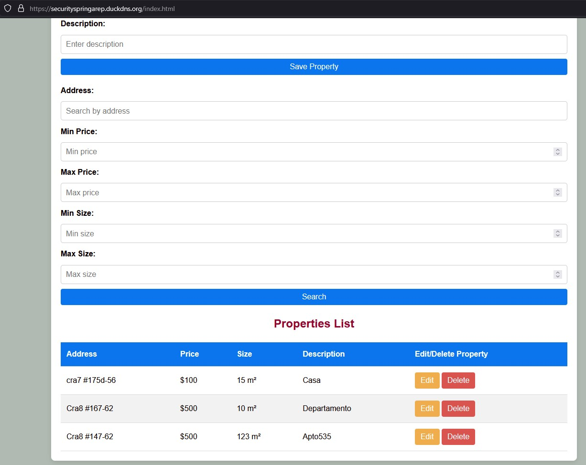
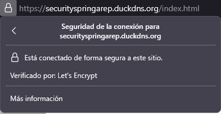

# DISEÑO APLICACION SEGURA

Este proyecto consiste en el desarrollo de una aplicacion web segura para la gestión de propiedades inmobiliarias. El objetivo es construir una aplicación web sencilla que permita a los usuarios realizar las siguientes operaciones sobre los listados de propiedades:

- Crear nuevos listados de propiedades.
- Leer y visualizar la lista completa de propiedades, así como los detalles de cada una.
- Actualizar la información de una propiedad existente.
- Eliminar listados de propiedades.

Ademas de implementar autenticacion de usuarios segura, encripcion TLS y demas practicas seguras.

## Autor

* **Nicolas Bernal** - Autor y Desarrollador del Proyecto

## Tecnologias utilizadas

- Java, HTML, JavaScript, CSS
- Maven
- AWS
- Spring Boot
- MySQL
- Certbot

## Arquitectura de la aplicacion

En este caso el sistema sigue una arquitectura de tres capas:

- Frontend: Interfaz gráfica del cliente, con la cual los usuarios pueden interactuar con los servicios ofrecidos por el back, en esta instancia unicamente se guardaron los archivos estaticos (html,css,js). El frontend se desplego en una instancia Ubuntu con apache instalado y configurado.
  
- Backend: Procesa las solicitudes del frontend y el tema de la autenticacion segura, maneja la lógica de negocio y se comunica con la base de datos. Usando JPA/Hibernate logra comunicarse con la base. El backend se desplego en una instancia Ubuntu con java instalado.
  
- Database: Almacena y gestionr la información de las propiedades inmobiliarias con MySQL. La tabla principal es properties, que almacena los datos de las propiedades, tambien posee otra tabla llamada users, en donde se guarda las credenciales de los usuarios incluidas las claves. Hibernate genera las tablas automáticamente. La base de datos se desplego en una instancia Amazon Linux, con MySQL instalado y configurado.

## Diseño de Clases

#### Modelo: 
Property → Representa una propiedad en la base de datos.

User → Representa un usuario en la base de datos.

#### Repositorio: 
PropertyRepository → Accede a los datos de las propiedades con JPA/Hibernate.

UserRepository → Accede a los datos de los usuarios utilizando JPA/Hibernate.

#### Servicio: 
PropertyService → Contiene la lógica de negocio relacionada con las propiedades.

UserService → Implementa la lógica de negocio relacionada con los usuarios, incluyendo el registro de nuevos usuarios y la autenticación.

#### Controlador: 
PropertyController → Expone los endpoints REST para todo el manejo y la gestion de las propiedades.

AuthController → Expone los endpoints REST para gestionar la autenticación y el registro de usuarios.

## Funcionalidades del servidor

El código está estructurado en diferentes clases y paquetes para no tener una sola clase llena de codigo, ademas de que es una buena practica y permite que todo este mas ordenado y compacto, hace que sea mas facil extender a posterior el codigo.

Entre las funcionalidades que se ofrecen encontramos las siguientes:

- Permite crear y administrar propiedades (editar, borrar).
- Cuenta con la funcion de busqueda por medio de filtros (precio, tamaño, direccion).
- Despliegue en la nube con AWS.
- Cuenta con un sistema de login y registro facil y rapido, pero tambien seguro.

## Funcionalidades claves de seguridad

- Encripcion TLS: Las comunicaciones entre back y front estan configuradas para funcionar con HTTPS.
- Autenticacion de usuarios: La aplicacion tiene implementado un login y registro seguro para los usuarios, en donde las contraseñas se "hashean" con BCrypt antes de almacenarlas.
- Manejo de certificados Let's Encrypt: Se generaron certificados TLS a partir de Let's Encrypt para el back y front.

## Despliegue en AWS

### Despliegue del frontend

Debemos crear una instancia en AWS. Una vez ya tengamos esto vamos a acceder a la maquina virtual por medio de consola.

Dentro de la maquina virtual vamos a instalar apache:

Debemos habilitar e iniciar el servicio:

Tambien vamos a instalar certbot para el manejo de los certificados de let's encrypt:

Luego debemos subir los archivos estaticos (.html, .js, .css) de la aplicacion a la maquina virtual, para eso vamos a usar una consola y usamos el siguiente comando:

Una vez ya tenemos estos archivos en la maquina, en el directorio /var/www/html, el front ya va a estar corriendo.

Si es necesario (en mi caso lo fue) debemos ir al security group de la instancia de AWS que estamos utilizando y debemos ajustar las reglas de entrada para que permita navegar correctamente por el servidor.

### Despliegue del backend

Debemos crear una instancia en AWS. Una vez ya tengamos esto vamos a acceder a la maquina virtual por medio de consola.

Dentro de la maquina virtual vamos a instalar Java, en este caso el 21:

Luego debemos subir el .jar y el archivo de application.properties de la aplicacion a la maquina virtual, para eso vamos a usar una consola y usamos el siguiente comando:

Una vez ya tenemos el .jar en la maquina, solo debemos ejecutarlo, para que la aplicacion comienze a correr.

Si es necesario (en mi caso lo fue) debemos ir al security group de la instancia de AWS que estamos utilizando y debemos ajustar las reglas de entrada para que permita navegar correctamente por el servidor.

Una vez hecho eso ya la aplicacion quedo correctamente desplegada, ademas esta ya quedo conectada a la base de datos gracias al archivo de application.properties

### Despliegue de la Base de Datos

Debemos crear una instancia en AWS. Una vez ya tengamos esto vamos a acceder a la maquina virtual, para hacerlo yo use PuTTy.

Dentro de la maquina virtual vamos a instalar MySQL:

Luego debemos iniciar y habilitar el servicio:

Luego realizamos toda la configuracion lo que incluye crear una nueva clave entre otras cosas:

Si es necesario (en mi caso lo fue) debemos ir al security group de la instancia de AWS que estamos utilizando y debemos ajustar las reglas de entrada para que permita navegar correctamente por el servidor.

Una vez hecho eso ya la base de datos quedo correctamente desplegada.

### Imagenes del front-back-database ya desplegados y funcionando

A continuacion se encuentran capturas del funcionamiento de la aplicacion ya desplegada:

### Video del Despliegue en AWS

